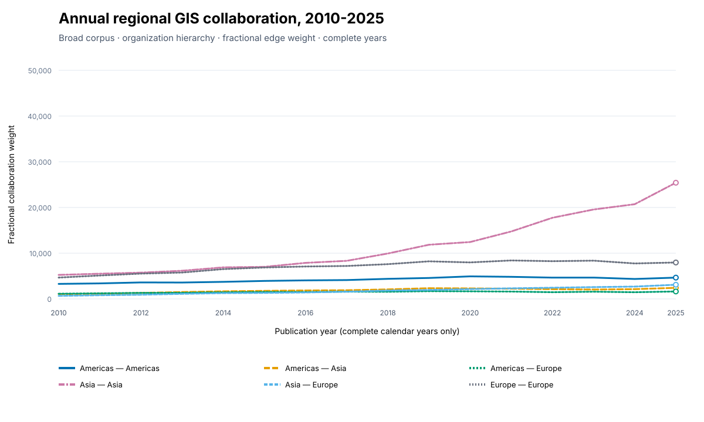
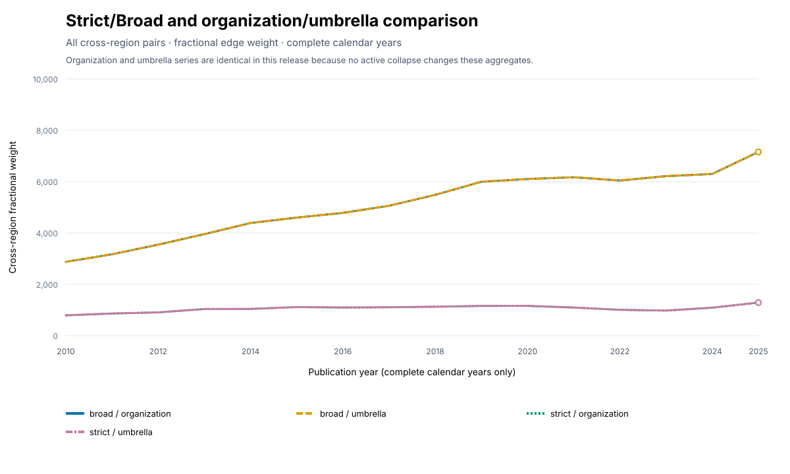
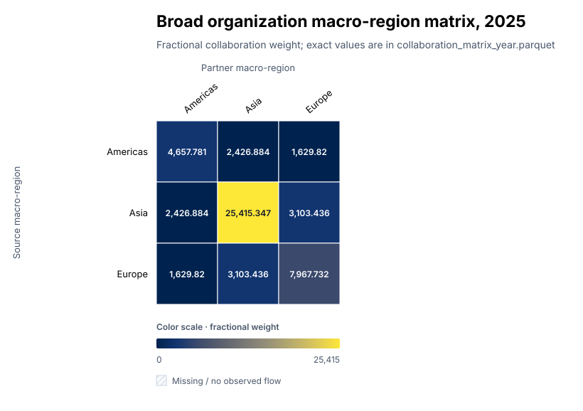

# GIS Research Collaboration and Institution Comparison

This repository builds a reproducible GIS and broader geospatial research system around
universities and research institutions. Its released scientific layer covers complete-year
collaboration networks from 2010–2025. The next product layer is an institution-first,
research-based school-decision system built without discarding or relabelling those annual outputs.

[](figures/school_decision_architecture.svg)

| Capability | Status on `main` |
| --- | --- |
| Complete-year annual collaboration analysis | Available |
| Separate citation-flow, Topic-proximity, and multiplex comparison layers | Available |
| Versioned school-decision analytical contract | Available |
| Publication-date QA | Available |
| Subannual month/quarter facts and sparsity QA | Available |
| Rolling 12/24/36-month facts | Available |
| Safe current-year acquisition | Planned: GISNET-124 |
| Complete School Finder, profiles, comparison, and ego maps | Planned: GISNET-126–138 |

The current dashboard remains the annual regional-analysis application until the remaining school
datasets and interfaces pass their acceptance checks. The available temporal foundations are not
presented as an already released School Finder.

## View the current annual results

The checked-in figures are publication-ready SVGs generated from processed data. Line color and
dash both identify series; matrix shading is accompanied by readable cell labels and a scale
legend, while exact values remain in the processed table.

[](figures/annual_region_trends.svg)

[](figures/view_comparison.svg)

[](figures/region_matrix.svg)

The interactive visualization is a local Streamlit application. From the repository root:

```bash
uv sync
uv run streamlit run dashboard/app.py
```

It opens at <http://localhost:8501> by default. GitHub displays the source files but does not
execute or render the Streamlit application itself. No hosted dashboard URL is currently
published; ordinary local viewing uses the checked-in processed snapshot and needs no API key.

The authoritative execution plan is
[`AI_EXECUTION_BACKLOG_GIS_COLLABORATION.md`](AI_EXECUTION_BACKLOG_GIS_COLLABORATION.md).

## Development setup

Python 3.11 or newer is required. With [uv](https://docs.astral.sh/uv/):

```bash
uv sync --extra dev
uv run python -m gisnet.cli status
uv run pytest
```

Set an OpenAlex API key only in the environment. The uppercase name takes priority;
the lowercase name is accepted for compatibility.

```bash
export OPENALEX_API_KEY='...'
uv run python -m gisnet.cli check-env
```

The key is never written to tracked configuration, caches, manifests, or run logs.

## Execution state

Agent task state and audit records live in `.agent/`. Generated raw, interim, cache,
and private output directories are intentionally ignored. All data-producing commands
will use temporary files, validate them, and atomically replace final outputs.

## Current commands

```bash
uv run python -m gisnet.cli status
uv run python -m gisnet.cli next-task
uv run python -m gisnet.cli check-env
uv run python -m gisnet.cli validate-school-contract --resume
uv run python -m gisnet.cli validate-regions
uv run python -m gisnet.cli discover-topics --resume
uv run python -m gisnet.cli sample-topic-works --resume
uv run python -m gisnet.cli freeze-topics
uv run python -m gisnet.cli validate-corpus-boundary
uv run python -m gisnet.cli profile-institution-types --resume
uv run python -m gisnet.cli profile-work-types --resume
uv run python -m gisnet.cli plan-download --dry-run
uv run python -m gisnet.cli plan-download --resume
uv run python -m gisnet.cli download-works --resume --workers 4
uv run python -m gisnet.cli normalize-works --resume
uv run python -m gisnet.cli extract-institutions --resume
uv run python -m gisnet.cli build-institutions --resume
uv run python -m gisnet.cli apply-geography --resume
uv run python -m gisnet.cli enrich-institutions --ror-mode cache --resume
uv run python -m gisnet.cli build-hierarchy --resume
uv run python -m gisnet.cli diagnose-versions --resume
uv run python -m gisnet.cli build-corpus --resume
uv run python -m gisnet.cli build-work-institutions --resume
uv run python -m gisnet.cli build-publication-date-qa --resume
uv run python -m gisnet.cli build-edges --resume
uv run python -m gisnet.cli build-citation-flows --resume
uv run python -m gisnet.cli build-topic-similarity --resume
uv run python -m gisnet.cli build-multiplex --resume
uv run python -m gisnet.cli build-outputs --resume
uv run python -m gisnet.cli build-subannual-facts --resume

uv run python -m gisnet.cli build-rolling-facts --resume
uv run python -m gisnet.cli build-region-flows --resume
uv run python -m gisnet.cli validate
uv run python -m gisnet.cli verify-reproducibility
uv run python -m gisnet.cli compute-edge-intensity --resume
uv run python -m gisnet.cli build-graphs --resume
uv run python -m gisnet.cli compute-metrics --resume
uv run python -m gisnet.cli detect-communities --resume
uv run python -m gisnet.cli match-communities --resume
uv run python -m gisnet.cli build-layout --resume
uv run python -m gisnet.cli audit-top-entities --resume
uv run python -m gisnet.cli run-sensitivity --resume
uv run python -m gisnet.cli build-figures --resume
uv run python -m gisnet.cli build-matrix --resume
uv run python -m gisnet.cli build-map-data --resume
uv run python -m gisnet.cli build-network-view --resume
uv run python -m gisnet.cli build-dashboard-data --resume
uv run python -m gisnet.cli run-pipeline --start-year 2010 --end-year 2025 --corpus all --hierarchy all --resume
uv run python -m gisnet.cli report --resume
uv run python -m gisnet.cli build-data-dictionary --resume
```

Network-dependent tests are marked `network` and are skipped from ordinary offline
quality gates unless explicitly selected.

Run the same offline checks used by GitHub Actions with:

```bash
scripts/quality-gate.sh
```

This runs Ruff lint/format checks, strict mypy, the default non-network test suite, and
the CLI status smoke check. Network tests are opt-in with `uv run pytest -m network`;
CI does not receive or print an OpenAlex API key.

The end-to-end command validates every output and provenance manifest before deciding
whether to skip or rebuild a stage. Incomplete downloads always resume, stale derived
branches rebuild in dependency order, valid raw pages are never deleted, and a failure
prints the exact recovery command.

## Dashboard snapshot and documentation

The checked-in eight-page annual dashboard includes regional trends,
collaboration matrices, geographic and fixed-layout network views, an institution-pair
explorer, Topic-family comparisons, methods, and data-quality metadata. See
[`dashboard/README.md`](dashboard/README.md) for snapshot rebuild details.

The generated research methods and limitations are documented in
[`outputs/reports/methodology.md`](outputs/reports/methodology.md).
Every public table column, primary key, null semantic, lineage path, configuration hash,
code hash, and known issue is documented in
[`outputs/reports/data_dictionary.md`](outputs/reports/data_dictionary.md), with a
machine-readable companion at [`data/reference/data_dictionary.json`](data/reference/data_dictionary.json).
Release contents, verification, upstream large-data links, and clean-clone reproduction
steps are collected in [`RELEASE.md`](RELEASE.md).

## School-decision analytical contract

The institution-first layer is under active development. Publication-date QA, month/quarter facts,
and rolling 12/24/36-month facts are available on `main`. Remaining work will add complete-universe
school search, research profiles, per-school collaboration partners, geographic flows, and direct
institutional comparison while preserving the existing complete-year annual analysis. The
versioned contract is documented in
[`docs/school_decision_analytical_contract.md`](docs/school_decision_analytical_contract.md), with
its strict machine-readable source in
[`config/school_decision.yml`](config/school_decision.yml).

This is research-based institutional comparison, not an admissions ranking. Activity,
specialization, collaboration reach and persistence, network position, citation influence,
research proximity, momentum, and user-defined fit remain independent dimensions. An unexplained
global university-quality score is prohibited; the optional `user_defined_fit_score` is UI-only
and its weights are never persisted in scientific source datasets. The provisional GIS Topic
registry and pending human-review warning remain in force.

### Publication-date QA layer

`build-publication-date-qa` preserves the released annual products and adds a parallel,
one-row-per-Work temporal fact plus recoverable coverage tables by corpus, year, institution, and
Topic family. Exact eligible months use `YYYY-MM`; quarters use `YYYY-Q1` through `YYYY-Q4`.
Missing, malformed, year-conflicting, or out-of-range values remain annual-only, and no month or
day is fabricated.

In the current frozen 2010–2025 snapshot, all 1,176,947 normalized Works have a source-supplied,
calendar-valid, year-consistent full date; Strict reconciles 190,205 eligible plus zero annual-only
Works and Broad reconciles 1,005,606 plus zero. These values describe source metadata coverage,
not independently verified date precision: 261,950 normalized Works use January 1 and the source
provides no separate precision flag. The QA layer measures and discloses that concentration rather
than inventing a January-1 exclusion rule.

Publication date is bibliographic observation time. It is not collaboration start, research
start, project start, or author-mobility time. Primary Strict/Broad counts continue to use the
released exact-DOI representative policy; the date layer does not merge version families or select
a new family date. Relative to the explicit all-version sensitivity, that policy excludes 129
Strict and 360 Broad exact-date-eligible Work records, affecting 71 Strict and 119 Broad publication
months in this snapshot (maximum monthly differences 7 and 14). Detailed counts, hashes, and output
paths are recorded in
[`data/reference/publication_date_qa_summary.json`](data/reference/publication_date_qa_summary.json).

### Subannual school-decision facts

`build-subannual-facts` adds sparse positive institution and collaboration facts at publication
month and quarter grain without changing any released annual file. These facts use the complete
`is_primary_research_scope` school-decision universe, including Africa, Oceania, and unknown
geography; this is intentionally broader than the legacy annual network's
Europe/Asia/Americas-only scope. Stable institution IDs and canonical organization/umbrella views
remain the join keys. A Work with `k` distinct eligible institutions contributes `1/k` to each
institution and `2 / (k * (k - 1))` to each unordered pair, so pair fractions sum to one.

The positive facts remain compact single Zstandard-compressed Parquet files. A separate sparsity
table derives zero cells arithmetically from the complete entity universe and 192 observed months
rather than materializing an entity-by-calendar Cartesian table. In the current snapshot,
Broad/Strict organization institution-month zero rates are 87.86%/93.54%; quarter rates are
77.70%/86.01%. Broad/Strict edge-month zero rates are 98.78%/99.11%, and the median active
institution month and edge month each contain one Work. Raw monthly views are therefore retained
for exact analysis and rolling inputs, but are not selected as a default ranking display.

Schemas, formulas, reconciliations, activity-tier definitions, storage sizes, and query benchmarks
are documented in [`docs/subannual_facts.md`](docs/subannual_facts.md). Current counts and hashes
are recorded in
[`data/reference/subannual_temporal_summary.json`](data/reference/subannual_temporal_summary.json).

`build-rolling-facts` adds exact rolling 12-, 24-, and 36-month institution metrics and a compact
exact edge-interval index. Calendar coverage is explicit and is not inferred from positive rows;
annual-only Works are never assigned fabricated months. The metric formulas, physical representation,
current cardinalities, query measurements, and deferred graph-metric policy are documented in
[`docs/rolling_facts.md`](docs/rolling_facts.md) and recorded in
[`data/reference/rolling_temporal_summary.json`](data/reference/rolling_temporal_summary.json).

## Optional directed citation-flow layer

`build-citation-flows` creates a separate knowledge-flow layer; it never relabels citation links
as collaboration. The stored direction is citing institution to cited institution, and the annual
key is the citing Work's publication year. Both Works must belong to the selected Strict or Broad
corpus and both endpoints must have an in-scope institution. A Work-to-Work citation contributes
one fractional unit divided across the Cartesian product of its citing and cited institutions;
institution self-flows remain explicit.

The builder makes no API request. References to Works outside the frozen corpus, internal Works
without an in-scope institution, and negative citation lags remain counted in
`data/reference/citation_flow_summary.json` and the generated
`citation_flow_coverage_year.parquet`; they are not silently treated as observed network edges.
The full edge and coverage tables are local processed outputs excluded from Git because of size.

## Optional Topic-similarity layer

`build-topic-similarity` constructs annual institutional vectors from the frozen registry Topics
eligible for each corpus. Each Work's source Topic score is divided across its in-scope
institutions, institutional vectors are L2-normalized, and cosine similarity is interpreted as
research proximity—not collaboration, citation, or causal influence. Uncertain and excluded
Topics do not enter the vectors.

Exact pairwise similarity is computed within a deterministic annual core ranked by Work count.
The default core contains at most 500 institutions per corpus/hierarchy/year, and the stored
undirected network is the union of each institution's 20 nearest neighbors. The generated coverage
table reports all in-scope institutions, nonzero-vector and zero-vector cases, core inclusion,
vector dimensions, all candidate pairs, pairs passing the similarity threshold, and retained
edges. Full vectors and edges remain local processed outputs; tracked provenance and current totals
are in `data/reference/topic_similarity_summary.json`.

## Optional multiplex comparison

`build-multiplex` compares the co-authorship, directed citation-flow, and Topic-proximity
networks without creating a merged graph or composite edge weight. Each annual layer summary
retains its own directionality, coverage boundary, weight definition, node and edge counts,
density, and total weight. Those totals have different units and are not compared as though they
were interchangeable.

Pairwise overlap uses only node and undirected dyad presence. Citation direction is discarded for
that dyad-presence calculation only; it remains explicit in the citation layer itself. The
Topic-proximity layer is still limited to its deterministic 500-institution annual core, so its
overlap values describe that bounded layer rather than all institutions. Defining a multiplex
score would require explicit layer weights and sensitivity analysis and is intentionally outside
this command. Tracked provenance and current totals are in
`data/reference/multiplex_comparison_summary.json`; the full annual tables remain local processed
outputs.

## Topic registry status

`config/topic_registry.yml` is currently a **provisional, AI-reviewed** registry backed
by candidate metadata and deterministic sampled-work evidence in
`outputs/reports/topic_review.md`. No human review is implied. Uncertain Topics are
excluded from primary Strict and Broad results and retained for sensitivity analysis.

## Current corpus and download policy

Institution and work-type mappings are explicit configuration rather than embedded code.
Unknown future source types remain flagged for review. The primary work set includes articles,
conference papers, reviews, data papers, and software papers; preprints and expanded types are
separate sensitivity views.

The saved bulk plan uses the Broad Topic set because it is a superset of Strict and can derive
both views after normalization. It shards by publication year, Topic, and eligible author-
institution country. Query-count estimates include expected duplicates across shards; downstream
normalization must deduplicate on OpenAlex Work ID while preserving source query IDs. The current
boundary precision is intentionally withheld until sufficient human annotation exists.

## Data availability and public-repository policy

The public repository contains source code, configuration, compact reference artifacts, manifests,
reproducibility instructions, and a compact thresholded processed snapshot in `dashboard/data/`.
It intentionally excludes credentials and large generated data: raw/cache pages, interim DuckDB
files, the full `data/processed/` Parquet layer, and private outputs are ignored by Git. These larger
layers are rebuilt locally rather than committed.

The bibliographic source is [OpenAlex](https://openalex.org/). Its
[API documentation](https://docs.openalex.org/) describes access to the upstream records; this
project's `plan-download`, `download-works`, and `normalize-works` commands reproduce the local data
layers from the tracked query plan and configuration. Normalization defaults to a bounded 6 GB
DuckDB memory limit and one worker thread so larger-than-memory processing spills safely to disk.
