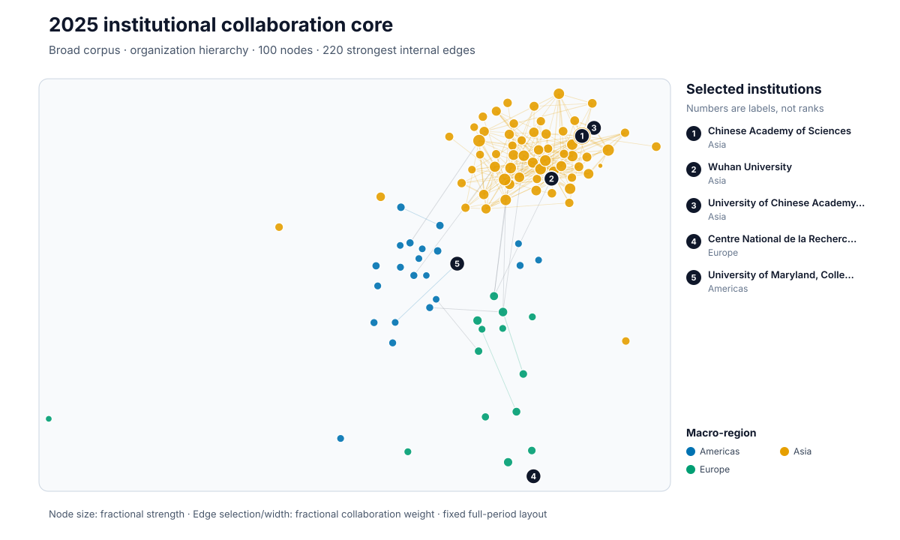
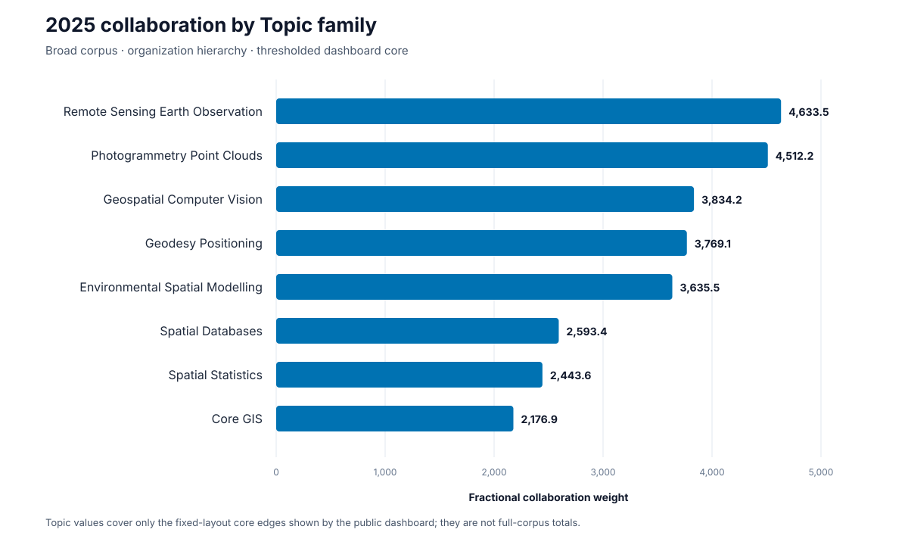

# GIS Research Collaboration Network

A reproducible view of GIS and geospatial research collaboration across institutions,
regions, and Topic families. The released annual analysis covers complete calendar years
from 2010 through 2025.

## Results

Click any figure to open the full-size SVG. The values come from the checked-in processed
snapshot; no API request is needed to view them.

| Regional trends | Institution network |
| --- | --- |
| [](figures/annual_region_trends.svg) | [](figures/network_snapshot.svg) |
| Six regional collaboration series, 2010–2025. | Top 100 institutions and 220 strongest internal edges in the 2025 Broad organization view. |

| Regional matrix | Topic profile |
| --- | --- |
| [](figures/region_matrix.svg) | [](figures/topic_family_profile.svg) |
| Fractional collaboration weight across macro-regions. | Eight largest Topic families in the thresholded dashboard core. |

[](figures/view_comparison.svg)

The interactive dashboard opens with the complete stable-ID School Finder and organizes the
released views into School Profile, Compare Schools, Geographic Flows, Institutional Network,
Global Trends, and Methods and Data Quality pages.

```bash
uv sync
uv run streamlit run dashboard/app.py
```

Open <http://localhost:8501>. See [`dashboard/README.md`](dashboard/README.md) for display
semantics and snapshot rebuild instructions.

## Current scope

| Capability | Status |
| --- | --- |
| Annual collaboration, citation-flow, Topic-proximity, and multiplex layers | Available |
| Publication-date QA and month/quarter facts | Available |
| Rolling 12/24/36-month facts | Available |
| Completed-month current-year acquisition overlay | Available; released annual snapshot remains through 2025 |
| School Finder, partner index, and school profiles | Available |
| Stable-ID school comparison service | Available |
| Geographic Flow Explorer | Available with thresholded, filter-comparable arcs at macro-region, subregion, and country levels |
| School Finder and seven-page decision-oriented navigation | Available |
| School Profile collaboration map | Available from the complete stable-ID index with institution/country/region partners and exact tables |
| Expanded School Profile UI | Available with ordered rolling activity, Topic, partner, annual network, citation-flow, research-proximity, and quality evidence |
| Advanced comparison UI | Available with aligned rolling, Topic, collaboration, network, and citation evidence |
| Separate scientific-layer views | Available for undirected co-authorship, directed citation-flow coverage, and thresholded Topic research proximity |
| Modular dashboard runtime | Available with cached snapshot access, page modules, predicate-pushed complete-school queries, and documented performance budgets |

[](figures/school_decision_architecture.svg)

The current `main` snapshot includes the validated school-decision extension while the immutable
`v0.1.0` tag remains the complete-year annual scientific release. Independent research dimensions
remain separate; the project does not create an unexplained university ranking. The contract is
documented in
[`docs/school_decision_analytical_contract.md`](docs/school_decision_analytical_contract.md).

## Two analytical modes

1. **Historical scientific mode** uses complete calendar years 2010–2025 for longitudinal
   collaboration, geographic-flow, community, citation-flow, Topic-proximity, and sensitivity
   analysis.
2. **Current school-decision mode** uses exact publication months/quarters and rolling 12/24/36-
   month windows through the checked-in snapshot endpoint, `2025-12`. School Finder, Profile, and
   Compare use stable IDs and keep activity, specialization, collaboration, centrality, citation,
   proximity, and data quality separate.

The stored GISNET-138 acceptance matrix passed all 13 checks. See
[`data/reference/school_decision_validation.json`](data/reference/school_decision_validation.json)
and its
[`manifest`](.agent/manifests/school_decision_validation.json). `School` is interface shorthand
for an eligible university or research institution; it is not an admissions recommendation,
degree-program claim, or universal institutional-quality score.

## Recent completed-month acquisition

Preview missing publication-month ranges without a request or write:

```bash
uv run python -m gisnet.cli sync-recent-works --dry-run
```

With `OPENALEX_API_KEY` supplied through the environment, run the resumable sync:

```bash
uv run python -m gisnet.cli sync-recent-works --resume
```

The command stops at the latest fully completed UTC calendar month, reuses validated raw pages
and checkpoints, normalizes into a separate `data/recent/processed` overlay, and never modifies
the historical 2010–2025 outputs. See
[`docs/recent_completed_month_sync.md`](docs/recent_completed_month_sync.md) for its date and
comparison contract.

## Reproduce and verify

Python 3.11 or newer is required.

```bash
uv sync --extra dev
uv run python -m gisnet.cli status
scripts/quality-gate.sh
```

Rebuild the two compact README gallery figures from the public dashboard snapshot:

```bash
uv run python -m gisnet.visualization.gallery
```

Reproduce the historical scientific mode first, then the current school-decision mode from those
validated sources:

```bash
uv run python -m gisnet.cli run-pipeline \
  --start-year 2010 --end-year 2025 \
  --corpus all --hierarchy all --resume
uv run python -m gisnet.cli validate-school-contract --resume
uv run python -m gisnet.cli build-publication-date-qa --resume
uv run python -m gisnet.cli build-subannual-facts --resume
uv run python -m gisnet.cli build-rolling-facts --resume
uv run python -m gisnet.cli build-school-identities --resume
uv run python -m gisnet.cli build-school-index --resume
uv run python -m gisnet.cli build-school-partners --resume
uv run python -m gisnet.cli build-school-profiles --resume
uv run python -m gisnet.cli build-dashboard-data --resume
uv run python -m gisnet.cli validate-school-decision --resume
uv run python -m gisnet.cli report --resume
uv run python -m gisnet.cli build-data-dictionary --resume
uv run python -m gisnet.release build --root .
uv run python -m gisnet.release verify --root .
```

Every data-producing command is lock-aware, resumable, and validates temporary output before
atomic replacement. See [`RELEASE.md`](RELEASE.md) for clean-clone prerequisites and ordering.

The authoritative task and acceptance contract is
[`AI_EXECUTION_BACKLOG_GIS_COLLABORATION.md`](AI_EXECUTION_BACKLOG_GIS_COLLABORATION.md).

## Read the results carefully

- Collaboration edges are co-authorship relationships, not citation or research-similarity links.
- Annual results use complete calendar years; 2025 is the latest complete year in this snapshot.
- Maps and fixed-layout networks are thresholded display subsets. Missing display edges do not
  prove that no collaboration exists in the full processed data.
- Publication month is bibliographic observation time, not research or project start time.
- The GIS Topic registry is provisional and still awaits human review.
- School profiles are bibliometric research evidence, not admissions, teaching-quality, cost, or
  degree-program evidence.
- Retained partner and thresholded map/network displays are not complete global edge matrices.
- Missing dates, coordinates, and unsupported layer values are not imputed.
- Credentials, raw API responses, caches, and large local processed files are not committed.

## Documentation and data

- [Release and clean-clone guide](RELEASE.md)
- [Generated methodology](outputs/reports/methodology.md)
- [Generated data dictionary](outputs/reports/data_dictionary.md)
- [Subannual fact definitions](docs/subannual_facts.md)
- [Rolling fact definitions](docs/rolling_facts.md)
- [Publication-date QA summary](data/reference/publication_date_qa_summary.json)
- [Subannual summary](data/reference/subannual_temporal_summary.json)
- [Rolling summary](data/reference/rolling_temporal_summary.json)
- [School-decision acceptance matrix](data/reference/school_decision_validation.json)

The bibliographic source is [OpenAlex](https://openalex.org/). Set `OPENALEX_API_KEY` only
in the environment when running network-dependent acquisition commands; the project never
writes it to tracked configuration, manifests, caches, or logs.
