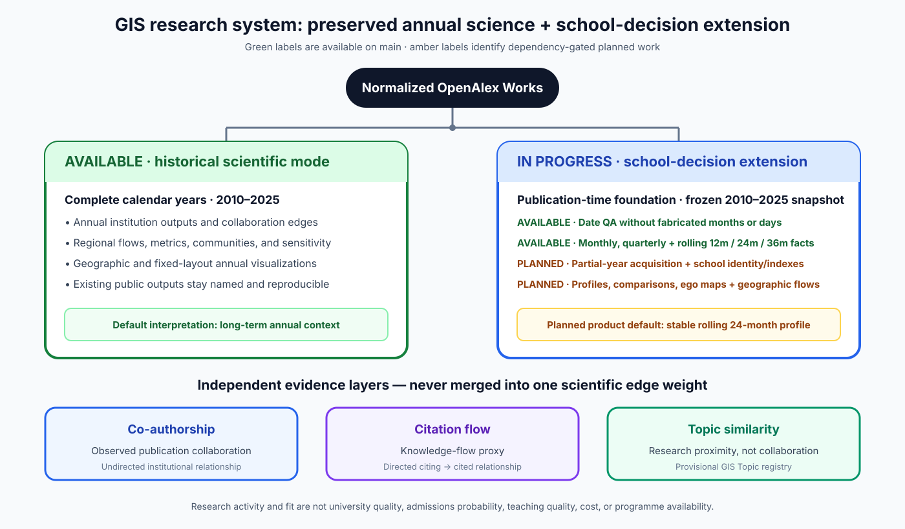

# Release guide

The stable `v0.1.0` release is the first reproducible public release of the 2010–2025 GIS
institutional collaboration network. It includes source code, frozen configuration, compact
processed aggregates, static figures, the interactive annual dashboard, methods, the data
dictionary, provenance manifests, limitations, and reproduction commands.

## Published channels

| Channel | Tag | Meaning |
| --- | --- | --- |
| Stable scientific release | [`v0.1.0`](https://github.com/jfang2048/gis_sci_network/releases/tag/v0.1.0) | Reproducible complete-year annual analysis |
| Development prerelease | [`school-decision-contract-v1`](https://github.com/jfang2048/gis_sci_network/releases/tag/school-decision-contract-v1) | Immutable contract snapshot; later temporal facts on `main` are not part of this tag |

The development prerelease does not replace the stable annual release. At that tagged snapshot it
did not claim that the School Finder or rolling-window datasets were complete. Since the tag,
publication-date QA, subannual facts, and rolling 12/24/36-month facts have become available on
`main`. The complete-index School Finder and seven-page institution-first information architecture
are also available. The ordered, multi-evidence School Profile and aligned two-to-four-school
comparison views are available.

[](figures/school_decision_architecture.svg)

## See the result

```bash
uv sync
uv run streamlit run dashboard/app.py
```

Open <http://localhost:8501>. Ordinary viewing uses only `dashboard/data/` and makes
no OpenAlex or ROR request.

## Verify the public release

```bash
uv run python -m gisnet.release verify
scripts/quality-gate.sh
```

`release/manifest.json` contains the size and SHA-256 checksum of every public
configuration file, compact table, reference artifact, static figure, report, and
provenance manifest. `release/manifest.json.sha256` protects the manifest itself.
The manifest checked in on `main` follows the current public asset set; immutable release tags
retain the manifest that was published at their tagged commit.

## Reproduce the data pipeline

Raw API responses and the full local processed layer are intentionally excluded from
the public repository. To rebuild them in a clean clone, provide the API key through
the environment only and run the resumable pipeline:

```bash
uv sync --extra dev
export OPENALEX_API_KEY='...'
uv run python -m gisnet.cli check-env
uv run python -m gisnet.cli run-pipeline \
  --start-year 2010 --end-year 2025 --corpus all --hierarchy all --resume
# Current temporal foundations for school-decision work.
uv run python -m gisnet.cli build-publication-date-qa --resume
uv run python -m gisnet.cli build-subannual-facts --resume
uv run python -m gisnet.cli build-rolling-facts --resume
uv run python -m gisnet.cli report --resume
uv run python -m gisnet.cli build-data-dictionary --resume
# Optional knowledge-flow extension; this is not a collaboration layer.
uv run python -m gisnet.cli build-citation-flows --resume
# Optional research-proximity extension; this is not a collaboration layer.
uv run python -m gisnet.cli build-topic-similarity --resume
# Optional separate-layer comparison; this does not define a composite network.
uv run python -m gisnet.cli build-multiplex --resume
uv run python -m gisnet.release build
uv run python -m gisnet.release verify
```

Interrupted downloads resume from checkpoints; valid raw pages are never deleted.
The API key is not written to configuration, manifests, datasets, or logs.

## Large upstream data links

- [OpenAlex data and snapshots](https://docs.openalex.org/download-all-data)
- [Research Organization Registry data dump](https://ror.readme.io/docs/data-dump)
- [United Nations M49 geography standard](https://unstats.un.org/unsd/methodology/m49/)

## Known limitations

- The Topic registry is provisional and has not received human review.
- Institution coordinates are sparse and are never imputed.
- Network and Topic dashboard pages use a thresholded public visualization core.
- Community matches below Jaccard 0.25 are retained but explicitly uncertain.
- The visualization score ranks display edges only and is not a primary research metric.
- 2025 is the last complete calendar year; partial 2026 observations are excluded.
- The school-decision analytical contract, publication-date QA, subannual facts, and rolling
  12/24/36-month facts are available on `main`. Safe partial-current-year acquisition, complete
  school search, expanded profile/ego-map, and aligned two-to-four-school rolling, Topic,
  collaboration, network-position, and citation-flow comparison views are available. Dedicated
  separate-layer co-authorship, directed citation-flow, and Topic research-proximity interfaces
  are also available with explicit coverage and display thresholds; no composite network exists.
- The optional citation layer is corpus-internal. Its coverage table reports references whose
  cited Work or in-scope cited institution is unavailable, and preserves negative citation lags
  as source-data anomalies rather than silently excluding them.
- The optional Topic-similarity layer is a union-top-k network over a deterministic annual core,
  not a complete all-institution similarity matrix. Its coverage table reports the omitted
  institution-year rows and the edge-selection boundary.
- The optional multiplex comparison keeps co-authorship, directed citation flow, and Topic
  proximity separate. Pairwise overlaps are unweighted node/dyad-presence diagnostics; citation
  direction is ignored only for dyad matching, and no cross-layer weight or composite score is
  defined. Topic-layer comparisons retain the 500-institution annual-core boundary.

See [`outputs/reports/methodology.md`](outputs/reports/methodology.md) for the full
method and limitations, and [`outputs/reports/data_dictionary.md`](outputs/reports/data_dictionary.md)
for column-level lineage and null semantics.
